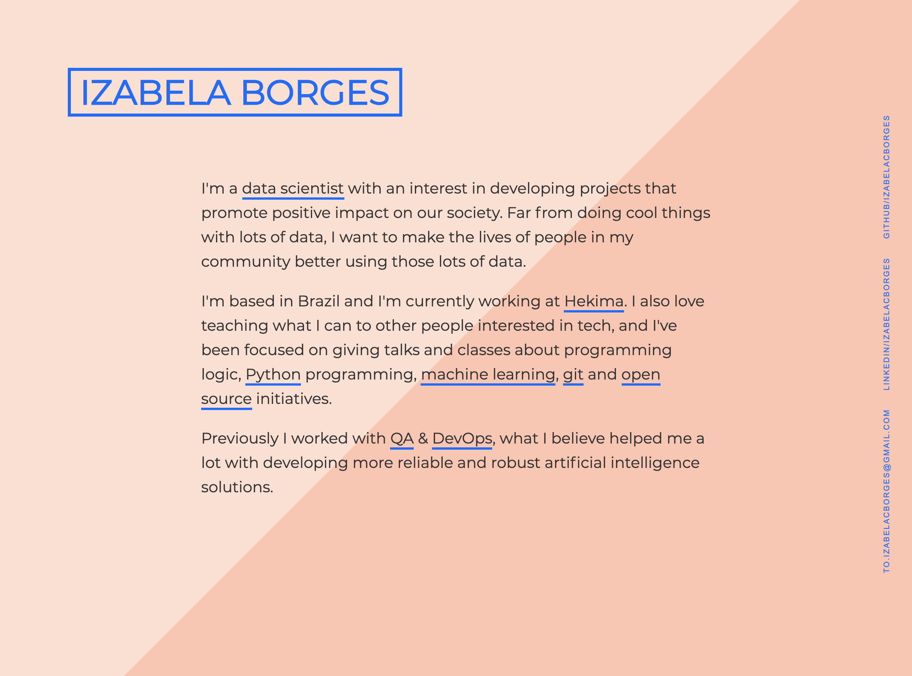

# izabelacborges.github.io

This is my very simple personal site.

## Create your own

You can create your own by forking the template repository from [jlord](http://jlord.github.io/) in [jlord/hello](https://github.com/jlord/hello).

See the demo at [jlord.github.io/hello](http://jlord.github.io/hello).